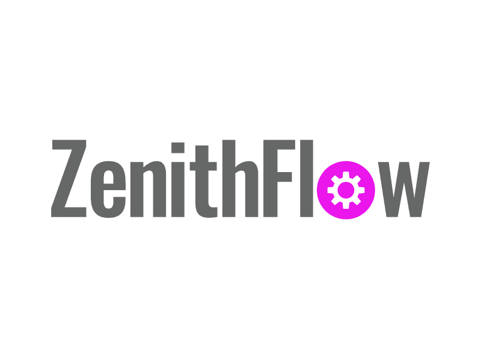
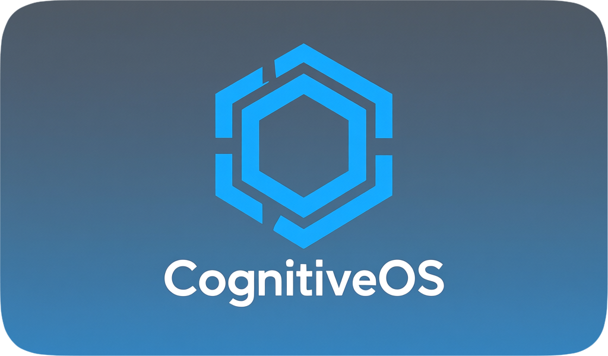

**The Operating System for Cognitive Warfare**

<a href="https://vimeo.com/1134634385">
  
   
  
</a>

---

Infrastructure for information dominance at machine speed. We transform strategic intent into measurable cognitive effects across the full spectrum: sense, process, and influence at scale.

**Built for the speed of relevance. Designed for cognitive effects. Ready for contested environments.**

### About Us

Veteran-founded. Laser-focused on cognitive dominance. We're not consultants who discovered defense tech—we're cognitive warfare practitioners who built the weapons we needed.

---

Fredericksburg, VA • info@zenithflow.com
